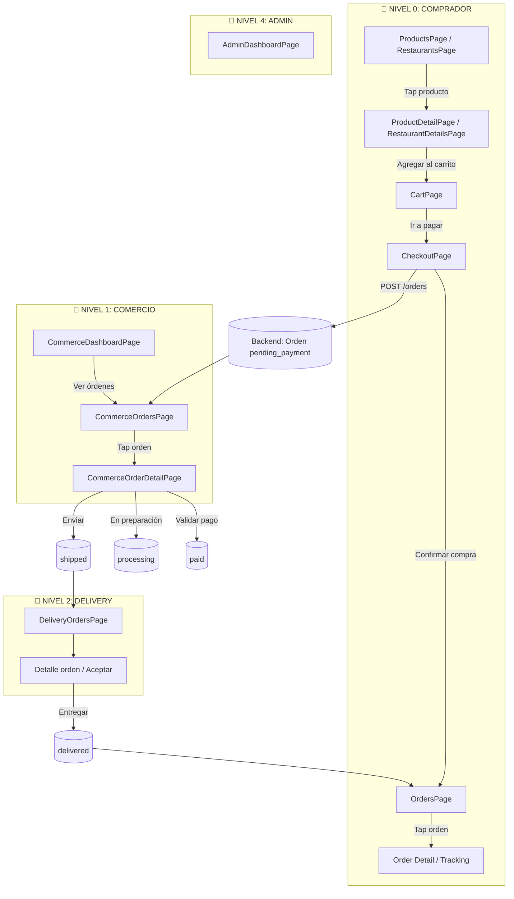
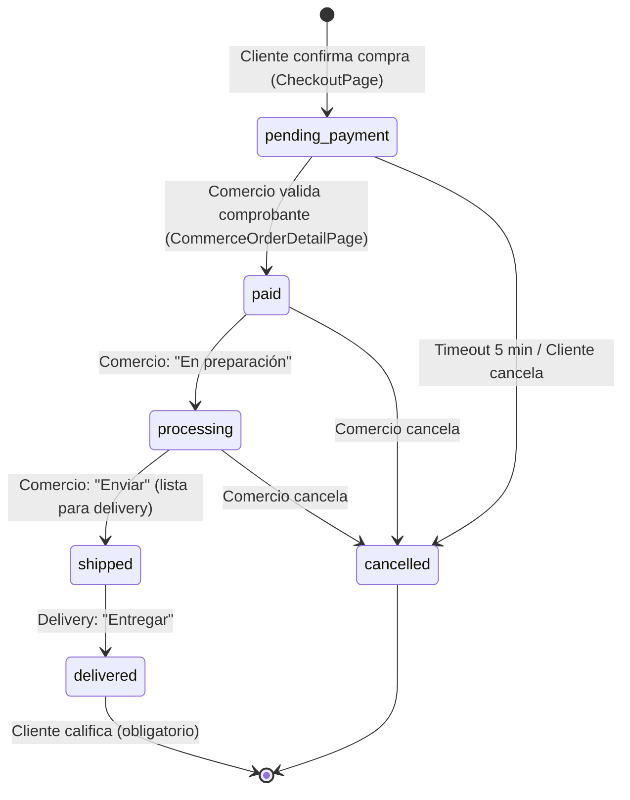
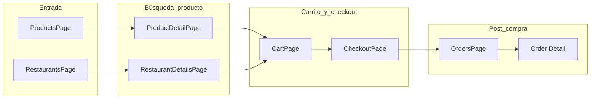
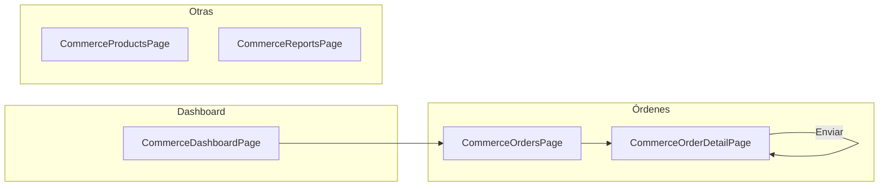
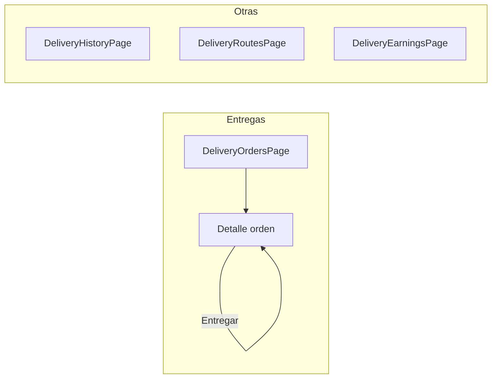
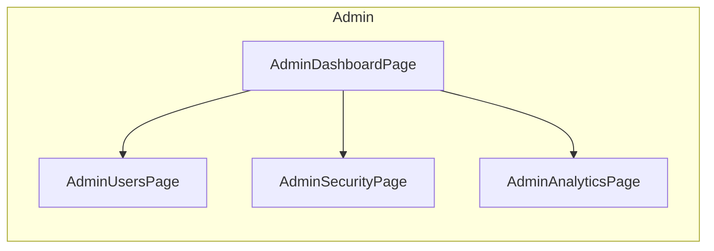
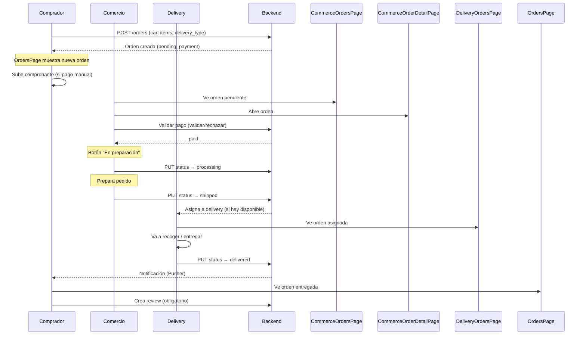

# Zonix Eats – Ciclo de compra y vistas por nivel

Documento de análisis del flujo completo de una compra, desde el inicio hasta la entrega, indicando qué ve y hace cada rol en cada paso.

---

## 1. Resumen de los 4 niveles (roles)

| Nivel | Rol | Pantallas principales | Participación en compra |
|-------|-----|------------------------|-------------------------|
| **0** | Comprador (users) | Productos, Carrito, Órdenes, Restaurantes | Crea orden, paga, recibe, califica |
| **1** | Comercio (commerce) | Dashboard, Órdenes, Productos, Reportes | Valida pago, prepara, envía |
| **2/3** | Delivery (rider/company) | Entregas, Historial, Rutas, Ganancias | Acepta, recoge, entrega |
| **4** | Admin | Panel Admin, Usuarios, Seguridad, Analytics | Supervisión, disputas |

---

## 2. Diagrama general – Flujo de una compra (inicio a fin)

---

## 3. Estados de la orden y acciones por nivel

| Estado | Quién lo cambia | Pantalla | Acción |
|--------|------------------|----------|--------|
| `pending_payment` | Sistema (al crear) | CheckoutPage → OrdersPage | Cliente sube comprobante (si aplica) |
| `paid` | Comercio | CommerceOrderDetailPage | Comercio: Validar / Rechazar comprobante |
| `processing` | Comercio | CommerceOrderDetailPage | Comercio: "En preparación" |
| `shipped` | Comercio | CommerceOrderDetailPage | Comercio: "Enviar" |
| `delivered` | Delivery | DeliveryOrdersPage (detalle) | Delivery: "Entregar" |
| `cancelled` | Cliente / Comercio | Varias | Cancelar según reglas |

---

## 4. Vista detallada por nivel – Qué ve cada uno durante la compra

### NIVEL 0: COMPRADOR (users)

| Paso | Vista | Acción | Siguiente |
|------|-------|--------|-----------|
| 1 | **ProductsPage** | Ver productos cercanos (geolocalización) | Tap producto |
| 2 | **ProductDetailPage** | Ver detalle, cantidad, notas, agregar | Tap "Agregar" |
| ALT | **RestaurantsPage** | Lista restaurantes | Tap restaurante |
| ALT | **RestaurantDetailsPage** | Ver menú, agregar productos | Tap "Agregar" |
| 3 | **CartPage** | Revisar carrito, ajustar cantidades | Tap "Ir a pagar" |
| 4 | **CheckoutPage** | Tipo entrega (pickup/delivery), dirección, confirmar | Tap "Confirmar compra" |
| 5 | **OrdersPage** | Lista de órdenes (Pusher actualiza estados) | Tap orden |
| 6 | **OrderDetailPage** | Ver estado, productos, total, **chat con comercio** (Pusher), subir comprobante (si pending_payment), cancelar (dentro 5 min) | - |

✅ **MVP:** `OrdersPage` navega a `OrderDetailPage` al hacer tap. El comprador puede subir comprobante (método de pago + referencia) y cancelar dentro del tiempo límite. **Chat:** Botón de chat abre `BuyerOrderChatPage`; mensajes en tiempo real vía **Pusher** (https://pusher.com).

ProductsPage y RestaurantsPage son vías alternativas; ambas alimentan el mismo carrito.

---

### NIVEL 1: COMERCIO (commerce)

| Paso | Vista | Acción | Resultado |
|------|-------|--------|-----------|
| 1 | **CommerceDashboardPage** | Resumen órdenes (paid, processing) | Tap orden o "Ver órdenes" |
| 2 | **CommerceOrdersPage** | Tabs: Todas, Pendientes, En Proceso, Enviadas, Entregadas, Canceladas | Tap orden |
| 3 | **CommerceOrderDetailPage** | Ver cliente, productos, total, **chat con cliente** (Pusher) | - |
| 3a | Si `pending_payment` + comprobante | Botones "Validar" / "Rechazar" | → paid o cancelled |
| 3a' | Si `pending_payment` (sin acuerdo tras chat) | Botón "Rechazar orden" (motivo opcional) | → cancelled |
| 3b | Si `paid` | "En preparación" / "Cancelar" | → processing |
| 3c | Si `processing` | "Enviar" / "Cancelar" | → shipped |

---

### NIVEL 2/3: DELIVERY (delivery_agent / delivery_company)

| Paso | Vista | Acción | Resultado |
|------|-------|--------|-----------|
| 1 | **DeliveryOrdersPage** | Ver órdenes asignadas (shipped) | Filtros: Todos, Pendientes, En Progreso, Completadas |
| 2 | **Detalle orden** | Ver dirección, cliente, productos | Aceptar (si pendiente) / Entregar |
| 3 | - | Tap "Entregar" | Estado → delivered |

Nota: Delivery ve órdenes en estado `shipped` que le han sido asignadas. La asignación se hace en backend (cercanía, disponibilidad).

---

### NIVEL 4: ADMIN

| Vista | Función en la compra |
|-------|----------------------|
| **AdminDashboardPage** | Supervisión general, métricas |
| **AdminUsersPage** | Gestión usuarios (buyer, commerce, delivery) |
| **AdminAnalyticsPage** | Reportes, analytics |
| **AdminSecurityPage** | Seguridad del sistema |

El admin no participa directamente en el ciclo de compra; supervisa y gestiona disputas según el modelo de negocio.

---

## 5. Secuencia temporal – Una compra de principio a fin

---

## 6. Navegación y rutas (MainRouter)

### Bottom nav por nivel

| Nivel | Índice 0 | 1 | 2 | 3 | Config |
|-------|----------|---|---|---|--------|
| 0 Comprador | ProductsPage | CartPage | OrdersPage | RestaurantsPage | SettingsPage2 |
| 1 Comercio | CommerceDashboardPage | CommerceOrdersPage | CommerceProductsPage | CommerceReportsPage | SettingsPage2 |
| 2 Delivery | DeliveryOrdersPage | DeliveryHistoryPage | DeliveryRoutesPage | DeliveryEarningsPage | SettingsPage2 |
| 3 Delivery Co. | DeliveryOrdersPage | DeliveryHistoryPage | DeliveryRoutesPage | DeliveryEarningsPage | SettingsPage2 |
| 4 Admin | AdminDashboardPage | AdminUsersPage | AdminSecurityPage | AdminAnalyticsPage | SettingsPage2 |

### Rutas con nombre (`Navigator.pushNamed`)

| Ruta | Pantalla |
|------|----------|
| `/order-details` | OrderDetailPage (comprador) |
| `/commerce/orders` | CommerceOrdersPage |
| `/commerce/order/:id` | CommerceOrderDetailPage |

### Navegación por push (ejemplos)

| Origen | Destino |
|--------|---------|
| ProductsPage | ProductDetailPage |
| RestaurantsPage | RestaurantDetailsPage |
| CartPage | CheckoutPage |
| CheckoutPage | OrdersPage |
| OrdersPage | OrderDetailPage |
| CommerceOrdersPage | CommerceOrderDetailPage |
| CommerceDashboardPage | CommerceOrderDetailPage |

---

## 7. Estado MVP (Febrero 2025)

| Área | Estado | Notas |
|------|--------|-------|
| CheckoutPage | ✅ | Calcula subtotal + envío (\$2.50 si delivery), envía delivery_fee al backend |
| OrderDetailPage | ✅ | Nueva: ver detalle, subir comprobante (método + referencia), cancelar (5 min) |
| OrdersPage | ✅ | Tap navega a OrderDetailPage; ruta /order-details en onGenerateRoute |
| Flujo comprobante | ✅ | Cliente sube en OrderDetailPage; backend valida payment_method y reference_number |
| Backend delivery_fee | ✅ | Acepta y guarda delivery_fee; valida total = subtotal + delivery_fee |
| Sincronización | ⚠️ | Carrito local; verificar addToRemoteCart vs restricción uni-commerce si se usa |
| Pusher | ⚠️ | OrdersPage suscrito a profile.{userId}; confirmar eventos de orden |
| **Pusher (chat)** | ✅ | BuyerOrderChatPage y CommerceChatMessagesPage suscritos a `private-order.{orderId}`; evento `NewMessage` para mensajes en tiempo real (https://pusher.com) |

---

## 8. Resumen ejecutivo

1. **Comprador**: ProductsPage / RestaurantsPage → ProductDetail / RestaurantDetails → CartPage → CheckoutPage → OrdersPage.
2. **Comercio**: CommerceOrdersPage → CommerceOrderDetailPage; valida pago, pasa a preparación y luego a enviado.
3. **Delivery**: DeliveryOrdersPage; recibe órdenes en `shipped`, las entrega y marca como `delivered`.
4. **Admin**: Supervisión y analytics, sin pasos obligatorios en el ciclo de compra.

Estados: `pending_payment` → `paid` → `processing` → `shipped` → `delivered`. Cada transición la ejecuta el rol correspondiente desde su detalle de orden.

---

*Documento generado a partir del análisis del código de Zonix Eats (frontend Flutter).*
*Fecha: Febrero 2025*
